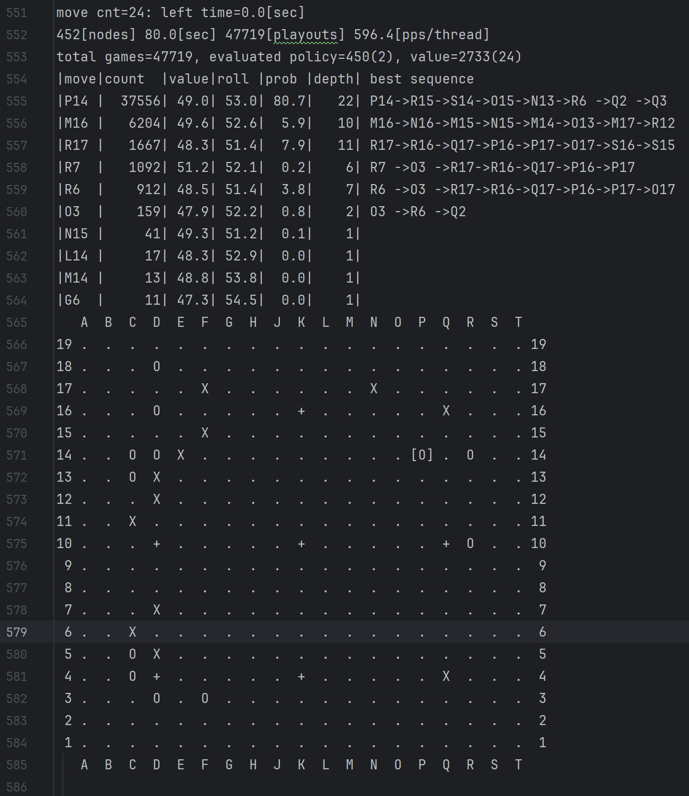

# Intro to the project #
## The Go engine ##
this project is based on an open source Go AI called 
"AQ", https://github.com/ymgaq/AQ/tree/master. 

It is a powerful engine and has a similar result compared with LeelaGo when run CPU environment
https://user-images.githubusercontent.com/25114663/31924367-31d5edba-b8b3-11e7-9893-90de4e8c0bd9.png.
It ranked top 4th in the **2018 Tencent World AI Weiqi Competition**, followed by FineArt(Jueyi), Golaxy and defeated LeelaZero.

In fact, I was attempting to equip with LeelaZero (Since it includes now more data), but I've come across some obstacle in dissolving some parameters, 
so I will try figuring it out in future.

## The results ##
The result is divided into roughly two parts: _**the log**_ and _**the rsgf file**_
### The log ###
It includes the whole evaluation process of the whole game. 

Let's use [24.txt](./log/24.txt) as an example:

Followed by the game node part(Where to replicate the former 23 moves players played) is the
analysis of move 24:

Where AQ carry out 47719 rollouts(playouts) in 80.0s (the maximum time step is set as 80s)
and display the results and his recommendation. **This includes all the nodes and analysis 
on it as you mentioned.**

_Please note that since I was using CPU to run the code, it is definitely insufficient as expected._

### Some explanation for the parameters: ###
#### move: ####
This code converts other coordinates into standard one: number for one axis and character 
for the other(without **I**). So the output is coordinated with this standard (like P14).

#### count: ####
The sum of nodes AQ visited

#### value: ####
Is often regarded as _winning rate_, however the author uses _value_ here.
See at:https://github.com/ymgaq/AQ/issues/20#issuecomment-336713680

#### roll: ####
winning rate of all the rollouts, can be simply regarded as **win times / sum(rollouts)**.

So the roll is a little different from value.

#### The rsgf ####
The rsgf files include two files: [.rsfg](./2013-01-02a_complete.rsgf) and [.csv](./2013-01-02a_complete.rsgf.csv)

The latter is more readable and clear.

You can open the latter to get results and see the results that meet your requirements,
including the current winning rate (Game Move).

Please note that since I did abundant runs, so some parts of the rgsf result is a little different from logs.
The rsgf is from a whole analysis of all the nodes, and I did a few runs after that. Unfortunately, 
I forgot to take action to avoid replication. That's the reason causes difference.

## Others ##
In the future work, I believe we have to run on GPU devices or Cloud server to 
gain more credible and stable results.

If you have any problem or suggestion in my work, please do let me know. 
That would be appreciated. 